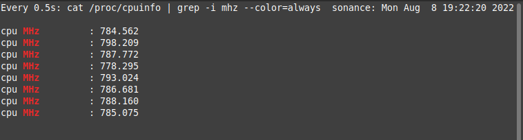

- [Linux Hardware](#linux-hardware)
  - [CPU Processor](#cpu-processor)
    - [GPU Graphics Card](#gpu-graphics-card)
  - [Secondary Storage Drives](#secondary-storage-drives)
  - [Disk](#disk)
    - [Disk Partition](#disk-partition)
  - [Audio](#audio)
  - [Network Card](#network-card)
  - [Generic](#generic)
    - [inxi](#inxi)
    - [inxi summary](#inxi-summary)
  - [System Monitoring Utility](#system-monitoring-utility)

# Linux Hardware

## CPU Processor
**cpu clocks** monitor with temps
```bash
watch -n 0.5 -c 'cat /proc/cpuinfo | grep -i mhz --color=always'
```
  


**cpu temperatures**
```sh
watch -n 0.5 -c 'sensors | grep -i temp --color=always'
```
similar to proc cpu
```
inxi -s
```
**output**
```
Sensors:
  System Temperatures: cpu: 47.0 C mobo: 44.0 C gpu: nvidia temp: 44 C 
  Fan Speeds (RPM): N/A
```


```sh
inxi -C
```


```
watch -n0.5 'inxi -t c'
```
**output**
```
Processes:
  CPU top: 5 
  1: cpu: 24.8% command: discord pid: 24010 
  2: cpu: 20.3% command: code pid: 4653 
  3: cpu: 8.5% command: code pid: 4551 
  4: cpu: 7.0% command: cinnamon pid: 2751 
  5: cpu: 6.8% command: xorg pid: 151
```

### GPU Graphics Card
trusty ol
```sh
nvidia-smi -l 1


watch -n0.1 nvidia-smi
```

**output**
```
Mon Aug  8 19:34:16 2022       
+-----------------------------------------------------------------------------+
| NVIDIA-SMI 510.85.02    Driver Version: 510.85.02    CUDA Version: 11.6     |
|-------------------------------+----------------------+----------------------+
| GPU  Name        Persistence-M| Bus-Id        Disp.A | Volatile Uncorr. ECC |
| Fan  Temp  Perf  Pwr:Usage/Cap|         Memory-Usage | GPU-Util  Compute M. |
|                               |                      |               MIG M. |
|===============================+======================+======================|
|   0  NVIDIA GeForce ...  Off  | 00000000:01:00.0 Off |                  N/A |
| N/A   45C    P0    N/A /  N/A |    307MiB /  2048MiB |     10%      Default |
|                               |                      |                  N/A |
+-------------------------------+----------------------+----------------------+
                                                                               
+-----------------------------------------------------------------------------+
| Processes:                                                                  |
|  GPU   GI   CI        PID   Type   Process name                  GPU Memory |
|        ID   ID                                                   Usage      |
|=============================================================================|
|    0   N/A  N/A      1519      G   /usr/lib/xorg/Xorg                119MiB |
|    0   N/A  N/A      2751      G   cinnamon                           27MiB |
|    0   N/A  N/A      3778      G   ...673219462117749135,131072      110MiB |
|    0   N/A  N/A      4551      G   ...RendererForSitePerProcess       45MiB |
+-----------------------------------------------------------------------------+
```


Graphics Details
```bash
inxi -G
```

```
Graphics:
  Device-1: Intel UHD Graphics 620 driver: i915 v: kernel 
  Device-2: NVIDIA GM108M [GeForce 930MX] driver: nvidia v: 510.85.02 
  Display: x11 server: X.Org 1.20.13 driver: modesetting,nvidia 
  unloaded: fbdev,nouveau,vesa resolution: 1366x768~60Hz, 1366x768~60Hz 
  OpenGL: renderer: NVIDIA GeForce 930MX/PCIe/SSE2 v: 4.6.0 NVIDIA 510.85.02
```


## Secondary Storage Drives
```
smartctl
```
to output harddrive health

## Disk
```bash
inxi -D
```
**output**
```
Drives:
  Local Storage: total: 238.47 GiB used: 215.95 GiB (90.6%) 
  ID-1: /dev/nvme0n1 vendor: SK Hynix model: PC401 HFS256GD9TNG-62A0A 
  size: 238.47 GiB
```

[Disk Monitoring](https://www.opsdash.com/blog/disk-monitoring-linux.html)
- iostat
- iotop
- dstat
- ioping


### Disk Partition
```bash
inxi -p
```
**output**
```
Partition:
  ID-1: / size: 233.44 GiB used: 215.93 GiB (92.5%) fs: ext4 
  dev: /dev/nvme0n1p2 
  ID-2: /boot/efi size: 239.2 MiB used: 5.2 MiB (2.2%) fs: vfat 
  dev: /dev/nvme0n1p1
```


## Audio
```bash
inxi -A
```
**output**
```
Audio:
  Device-1: Intel Sunrise Point-LP HD Audio driver: snd_hda_intel 
  Sound Server: ALSA v: k5.4.0-122-generic
```

## Network Card
```sh
inxi -N
```
```
Network:
  Device-1: Realtek RTL8111/8168/8411 PCI Express Gigabit Ethernet 
  driver: r8169 
  Device-2: Intel Wireless 8265 / 8275 driver: iwlwifi
```

## Generic

check if all system recommended softwares present.
```sh
inxi --recommends

inxi --recommends | grep --color=always -ie "missing"
```
these are the few.

### inxi
complete guide on [inxi](https://www.tecmint.com/inxi-command-to-find-linux-system-information/)

```sh
inxi
```
output
```
CPU: Quad Core Intel Core i7-8550U (-MT MCP-) speed/min/max: 735/400/1800 MHz 
Kernel: 5.4.0-122-generic x86_64 Up: 23m Mem: 4160.6/7849.8 MiB (53.0%) 
Storage: 238.47 GiB (90.6% used) Procs: 360 Shell: zsh 5.8 inxi: 3.0.38
```

### inxi summary
```bash
inxi -b
```

```bash
inxi -F
```


**Laptop Information**
```
inxi -M
```
```
Machine:
  Type: Laptop System: HP product: HP ProBook 450 G5 v: N/A serial: 5CD8350HG1 
  Mobo: HP model: 837D v: KBC Version 02.2D.00 serial: PGWGL038JB80MQ UEFI: HP 
  v: Q85 Ver. 01.03.00 date: 07/20/2018
```


you can also use
```
inxi -t cm10
```


## System Monitoring Utility

1. Bashtop
2. Stacer
3. bpytop

